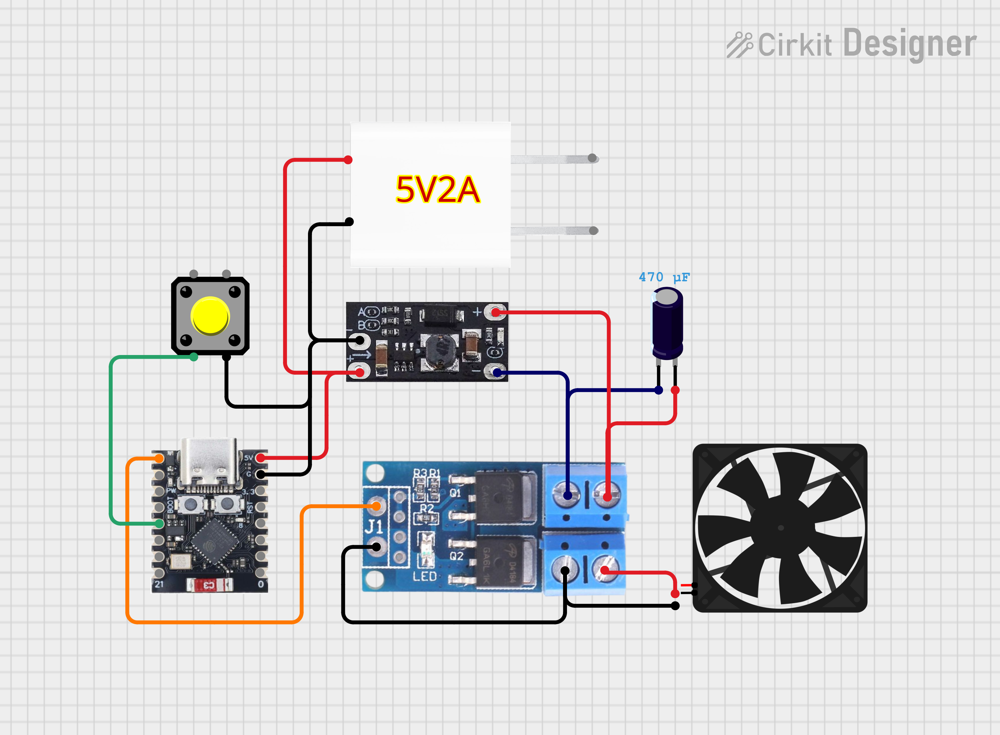

# 🔧 Hardware – Smart Table Fan (ESP32-C3)

## Overview
This project repurposes a **Goojodoq table fan** and enhances it by **overdriving the motor voltage** and adding an **ESP32-C3** for smart control.

The core idea is simple:
- Increase fan performance using a **boost converter**
- Stabilize power using a **capacitor**
- Add intelligence using **ESP32 PWM control**

> ⚠️ Overdriving hardware always carries risk. Proper testing and limits are required.

---

## Overdriving Concept

The fan’s original maximum voltage was measured at:
- **~9V–10V at max speed**

By boosting to:
- **12V (~20% increase)**

This provides:
- Higher airflow
- Increased performance

### Rule of Thumb
- Safe overdrive ≈ **+20% of original max voltage**
- Going beyond this may:
  - Overheat motor
  - Reduce lifespan
  - Cause permanent damage

> Always measure your fan before applying overvoltage.

---

## Core Components

- **ESP32-C3 Super Mini** (controller)
- **Goojodoq Table Fan** (modified)
- **Boost Converter** (5V → 12V)
- **PWM Motor Driver** (MOSFET-based)
- **Capacitor** (for voltage stability)
- **Push Button** (manual control)
- **5V Power Supply**

---

## Key Hardware Insight

At the very core, only two components are essential for the modification:
- **Boost converter** → increases speed (performance)
- **Capacitor** → ensures stable operation

The ESP32 is optional but enables:
- Smart control
- Scheduling
- Automation
- Precision speed control

---

## Wiring

### Circuit Diagram

---

### Power Distribution
1. Connect **5V supply →**
   - Boost converter input
   - ESP32 VIN
   - ESP32 GND

---

### Motor Path
2. Boost converter output → **PWM motor driver input**  
3. Motor driver output → **Fan motor**

---

### Control Signals
4. ESP32 GPIO connections:
   - **GPIO 5 → PWM signal** (to motor driver)
   - **GPIO 9 → Button input (optional)**

---

### Button Wiring (Optional)
- **VCC → Button → GPIO 9**
- Uses internal pull-up configuration

---

## Notes & Considerations

- Ensure your **power supply can handle increased current**
- Add **cooling if running at higher voltage**
- Use a **proper MOSFET driver** (not direct GPIO)
- Capacitor helps:
  - Reduce voltage ripple
  - Prevent unstable motor behavior

---

## Limitations

- No feedback system (no RPM sensor)
- Open-loop control only
- Performance depends on fan build quality

---

## Future Improvements

- Add **temperature sensor**
- Add **RPM feedback (tachometer)**
- Improve efficiency with better driver circuit